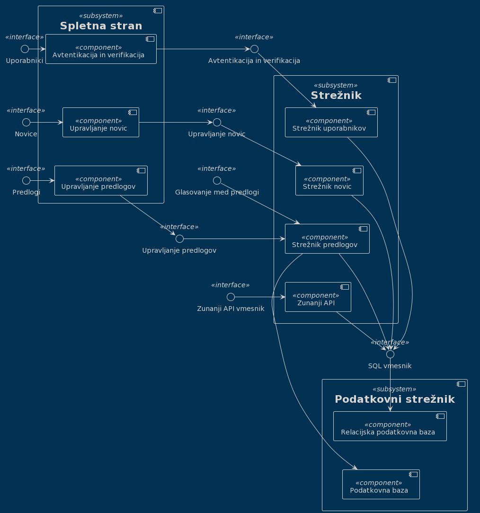

# Načrt sistema

|                             |                                                                          |
| :-------------------------- | :----------------------------------------------------------------------- |
| **Naziv projekta**          | Občinski obveščevalnik                                                   |
| **Člani projektne skupine** | Luka Markićević, Haris Kupinić, Luka Brodnik, Elena Najdova, Luka Pantar |
| **Kraj in datum**           | Ljubljana, 21.4.2022                                                     |

## Povzetek

V dokumentu je opisan podroben načrt našega sistema. Na začetku je predstavljen načrt arhitekture, ki je prikazan s pomočjo treh pogledov: logičnega, razvojnega ter fizičnega, za katere je uporabljeno ogrodje PlantUML. Po arhitekturnem načrtu, sledi predstavitev uporabljenih načrtovalskih vzorcev. Zatem sledi načrt strukture, ki je predstavljen s pomočjo razrednega diagrama, kjer so prisotni vsi razredi ter povezave med njimi. Načrtu strukture sledi podrobna predstavitev razredov ter njihovih metod in atributov. Na koncu dokumenta je še predstavljen načrt obnašanja, kjer so, v obliki diagramov zaporedja, predstavljene vse funkcionalnosti sistema oz. njihovi osnovni in alternativni tokovi. 

## 1. Načrt arhitekture

### Razvojni pogled

### Fizični pogled

### Logični pogled

## 2. Načrt strukture

### 2.1 Razredni diagram

:dart: **TO-DO**

- Izdelajte razredni diagram.
- Za izdelavo uporabite ogrodje PlantUML, in sicer [Class Diagram](https://plantuml.com/class-diagram).
- V poročilo vključite **izvorno kodo diagrama v jeziku PlantUML**, ki naj bo prisotna v repozitoriju, sliko diagrama pa vključite s povezavo (in ne preko neposredne vključitve binarne datoteke) preko storitve [`https://teaching.lavbic.net/plantuml`](https://teaching.lavbic.net/plantuml), kot prikazuje spodnji primer.
- Diagram naj bo **jasno berljiv**, sicer ga razdelite v več delov.

**Razredni diagram** (izvorna koda :bar_chart: [PlantUML](../gradivo/plantuml/RD.puml))

### 2.2 Opis razredov

:dart: **TO-DO**

- Vsak razred podrobno opišite. Opis posameznega razreda naj ima sledečo strukturo:

#### Ime razreda :dart: **TO-DO**

- Koncept iz problemske domene, ki ga razred predstavlja.

#### Atributi

:dart: **TO-DO**

- Za vsak atribut navedite:
  - ime atributa,
  - podatkovni tip, če ta ni očiten,
  - pomen, če ta ni samoumeven,
  - zalogo vrednosti, če ta ni neomejena ali očitna.

#### Nesamoumevne metode

:dart: **TO-DO**

- Za vsako metodo navedite:
  - ime metode,
  - imena in tipe parametrov,
  - tip rezultata,
  - pomen (če ta ni dovolj očiten iz naziva metode in njenih parametrov).

**1.Uporabnik (Entity)**

U tem razredu shranimo podatke o uporabniki.

**Atributi:**

| **Ime atributa** | **Podatkovni tip** |           **Pomen(če ni očiten)**            |   **Zaloga vrednosti (če ni očiten)**    |
| :--------------: | :----------------: | :------------------------------------------: | :--------------------------------------: |
|   uporabnikId    |        int         |           Identifikator uporabnika           |                    -                     |
|       ime        |       string       |                Ime uporabnika                |             /^[a-zA-Z\s]\*$/             |
|     priimek      |       string       |              Priimek uporabnika              |             /^[a-zA-Z\s]\*$/             |
| uporabnisko ime  |       string       |               Uporabnisko ime                |       /^[a-zA-Z0-9]([._-](?![._-])       | [a-zA-Z0-9]){3,18}[a-zA-Z0-9]$/ |
|     obcinaId     |        int         | Identifikator obcine v kateri zivi uporabnik |                    -                     |
|      email       |       string       |               Email uporabnika               |             /^\S+@\S+\.\S+$/             |
|      geslo       |       string       |               Geslo uporabnika               | /^(?=.*[A-Za-z])(?=.*\d)[A-Za-z\d]{8,}$/ |
|      slika       |       Image        |               Slika uporabnika               |                    -                     |
|    sporocila     |  List<Sporocilo>   |             Sporocila uporabnika             |                    -                     |

**Nesamoumevne metode:**

|     **Ime metode**      |             **Imena in tipi parametrov**             | **Tip rezultata** |                         **Pomen**                         |
| :---------------------: | :--------------------------------------------------: | :---------------: | :-------------------------------------------------------: |
|     dodajUporabnika     |                 uporabnik: Uporabnik                 |    StatusCode     |   Dodajanje uporabnika v bazi registriranih uporabnikov   |
|   posodobiUporabnika    |                 uporabnik: Uporabnik                 |     Uporabnik     | Posodabljanje uporabnika v bazi registriranih uporabnikov |
|    izbrisiUporabnika    |                   uporabnikId: int                   |    StatusCode     |   Brizanje uporabnika iz bazi registriranih uporabnikov   |
|     posljiSporocilo     | posljateljId: int, prejemnikId: int, vsebina: string |     Sporocilo     |                    Pošiljanje sporčila                    |
|     vrniUporabnika      |                   uporabnikId: int                   |     Uporabnik     |                 Vrne podatke o uporabniku                 |
|    vrniVseUporabnike    |                          -                           |  List<Uporabnik>  |               Vrne seznam vseh uporabnikov                |
|     preveriPodatke      |                  podatki: Uporabnik                  |    StatusCode     |      Preverja ustreznost podatkov preden jih shrani       |
| preveriPodatkeZaPrijavo |             email: string, geslo: string             |    StatusCode     |          Preveri ustreznost podatkov za prijavo           |
|    prijaviUporabnika    |             email: string, geslo: string             |    StatusCode     |           Doda uporabnik v seznamu prijavljenih           |
|    odjaviUporabnika     |                   uporabnikId: int                   |    StatusCode     |        Odstrani uporabnik iz seznama prijavljenih         |

**2.Sporočilo (Entity)**

Sporočilo shranjuje komunikacijo med uporabniki

**Atributi:**

| **Ime atributa** | **Podatkovni tip** |  **Pomen(če ni očiten)**  | **Zaloga vrednosti (če ni očiten)** |
| :--------------: | :----------------: | :-----------------------: | :---------------------------------: |
|   sporociloId    |        int         |  Identifikator sporocila  |                  -                  |
|  posiljateljId   |        int         | Identifikator posljatelja |                  -                  |
|   prejemnikId    |        int         | Identifikator prejemnika  |                  -                  |
|     vsebina      |       String       |     Vsebina sporocila     |                  -                  |

**Nesamoumevne metode:**

|   **Ime metode**   | **Imena in tipi parametrov** | **Tip rezultata** |                     **Pomen**                      |
| :----------------: | :--------------------------: | :---------------: | :------------------------------------------------: |
|   dodajSporocilo   |     sporocilo: Sporocilo     |    StatusCode     |        Dodajanje sporočilo v bazi sporočila        |
|   vrniSporocilo    |       sporociloId: int       |     Sporocilo     |              Vrne podatke o sporočilu              |
|  vrniVsaSporocila  |              -               |  List<Sporocilo>  |             Vrni seznam vseh sporočil              |
| vrniVsePosiljatelj |     posliljateljId: int      |  List<Sporocilo>  |       Vrni seznam vseh sporočil pošiljatelja       |
|  vrniVsePrejemnik  |       prejemnikId: int       |  List<Sporocilo>  |        Vrni seznam vseh sporočil prejemnika        |
|   preveriPodatke   |      podatki: Sporocilo      |    StatusCode     | Preveri ustreznost podatke preden pošlje sporočilo |

**3.Komentar (Entity)**

Komentar je razred v katerem shranjujemo komentarje ki jih uporabnik dodaja pod objavo

**Atributi:**

| **Ime atributa** | **Podatkovni tip** |            **Pomen(če ni očiten)**            | **Zaloga vrednosti (če ni očiten)** |
| :--------------: | :----------------: | :-------------------------------------------: | :---------------------------------: |
|    komentarId    |        int         |           Identifikator komentarja            |                  -                  |
|   uporabnikId    |        int         | Identifikator uporabnika ki je dodal komentar |                  -                  |
|     objavaId     |        int         | Identifikator objave na katero je komentiral  |                  -                  |
|     komentar     |       string       |              Vsebina komentarja               |                  -                  |

**Nesamoumevne metode:**

|      **Ime metode**      | **Imena in tipi parametrov** | **Tip rezultata** |                       **Pomen**                       |
| :----------------------: | :--------------------------: | :---------------: | :---------------------------------------------------: |
|      dodajKomentar       |      podatki: Komentar       |    StatusCode     |                  Dodajanje komentar                   |
|     izbrisiKomentar      |       komentarId: int        |    StatusCode     |                   Brisanje komentar                   |
|       vrniKomentar       |       komentarId: int        |     Komentar      |               Vrne podatki o komentarja               |
|    vrniVseKomentarje     |              -               |  List<Komentar>   |         Vrni seznam vseh komentarjev predloga         |
| vrniKomentarjeUporabnika |       uporabnikId: int       |  List<Komentar>   | Vrni seznam vseh komentarjev od dolocenega uporabnika |
|      preveriPodatke      |      podatki: Komentar       |    StatusCode     |              Preveri ustreznost podatki               |

**4.Novica (Entity)**

Novica je razred v katerem shranjujemo novice ki jih uporabnik dodaja

**Atributi:**

| **Ime atributa** | **Podatkovni tip** |             **Pomen(če ni očiten)**             | **Zaloga vrednosti (če ni očiten)** |
| :--------------: | :----------------: | :---------------------------------------------: | :---------------------------------: |
|     novicaId     |        int         |              Identifikator novice               |                  -                  |
|      naslov      |       string       |                  Naslov novice                  |                  -                  |
|     avtorId      |        int         |          Identifikator avtorja novice           |                  -                  |
|     vsebina      |       string       |                 Vsebina novice                  |                  -                  |
|     obcinaId     |        int         | Identifikator obcine na katera se nanaša novico |                  -                  |
|      datum       |        date        |               Datum objave novice               |                  -                  |
|     lokacija     |       string       |           Podrobna lokacija za novici           |                  -                  |

**Nesamoumevne metode:**

| **Ime metode** | **Imena in tipi parametrov** | **Tip rezultata** |                       **Pomen**                       |
| :------------: | :--------------------------: | :---------------: | :---------------------------------------------------: |
|  dodajNovico   |       podatki: Novica        |    StatusCode     |                 Dodaja novico v bazi                  |
| posodobiNovico |       podatki: Novica        |    StatusCode     |              Posodabljanje novico v bazi              |
| izbrisiNovico  |        novicaId: int         |    StatusCode     |                Brisanje novico iz bazi                |
|   vrniNovico   |        novicaId: int         |      Novica       |                 Vrne podatki o novico                 |
| vrniVseNovice  |              -               |   List<Novica>    |                Vrne seznam vseh novice                |
| vrniVseAvtorja |         avtorId: int         |   List<Novica>    |         Vrne seznam novice od določeni avtor          |
| vrniVseObcina  |        obcinaId: int         |   List<Novica>    |          Vrne seznam novic v določeni občini          |
| preveriPodatke |       podatki: Novica        |    StatusCode     | Preveri ustreznosti podatki preden doda novico v bazi |
| izvediIskanje  |    iskalnaBeseda: string     |   List<Novica>    |     Izvede selekcijo novice glede iskalno besedo      |

**5.Predlog (Entity)**

Predlog je razred v katerem shranjujemo predlog ki jih uporabnik dodaja

**Atributi:**

| **Ime atributa** | **Podatkovni tip** |              **Pomen(če ni očiten)**              | **Zaloga vrednosti (če ni očiten)** |
| :--------------: | :----------------: | :-----------------------------------------------: | :---------------------------------: |
|    predlogId     |        int         |              Identifikator predloga               |                  -                  |
|      naslov      |       string       |                  Naslov predloga                  |                  -                  |
|     avtorId      |        int         |          Identifikator avtorja predloga           |                  -                  |
|     vsebina      |       string       |                 Vsebina predloga                  |                  -                  |
|     obcinaId     |        int         | Identifikator obcine na katera se nanaša predloga |                  -                  |
|  steviloVseckov  |        int         |    Število uporabniki ki so všečkali predlogo     |                  -                  |
| steviloNevseckov |        int         |   Število uporabniki ki so nevšečkali predlogo    |                  -                  |
|      datum?      |        date        |               Datum objavo predloga               |                  -                  |
|     lokacija     |       string       |           Podrobna lokacija za predloga           |                  -                  |

**Nesamoumevne metode:**

| **Ime metode**  | **Imena in tipi parametrov** | **Tip rezultata** |                     **Pomen**                     |
| :-------------: | :--------------------------: | :---------------: | :-----------------------------------------------: |
|  dodajPredlog   |       podatki: Predlog       |    StatusCode     |             Dodajanje predloga v bazi             |
| posodobiPredlog |       podatki: Predlog       |    StatusCode     |           Posodabljanje predloga v bazi           |
| izbrisiPredlog  |        predlogId: int        |    StatusCode     |                 Brisanje predloga                 |
|   vrniPredlog   |        predlogId: int        |      Predlog      |              Vrne podatke o predlogu              |
| vrniVsePredloge |              -               |   List<Predlog>   |            Vrne seznam vseh predlogov             |
| vrniVseAvtorja  |         avtorId: int         |   List<Predlog>   |    Vrne seznam predlogov od določenega avtorja    |
|  vrniVseObcina  |        obcinaId: int         |   List<Predlog>   |      Vrne seznam predlogov v določeni občini      |
| preveriPodatke  |       podatki: Predlog       |    StatusCode     | Vreveri ustreznost podatke preden shrani predloga |
|  izvediIskanje  |    iskalnaBeseda: string     |   List<Predlog>   | Vrne selektiranih predlogov glede iskalno besedo  |

**6.Sprejeti Predlog (Entity)**

Razred v katerem shranimo sprejete predloge

**Atributi:**

| **Ime atributa** | **Podatkovni tip** |      **Pomen(če ni očiten)**      | **Zaloga vrednosti (če ni očiten)** |
| :--------------: | :----------------: | :-------------------------------: | :---------------------------------: |
|    predlogId     |        int         | Identifikator sprejetega predloga |                  -                  |

**Nesamoumevne metode:**

| **Ime metode** | **Imena in tipi parametrov** | **Tip rezultata** |               **Pomen**                |
| :------------: | :--------------------------: | :---------------: | :------------------------------------: |
| sprejmiPredlog |        predlogId: int        |       void        | Doda predloga v bazi sprejeti predlogi |

**7.Uporabniki Kontroler (Control)**

Krmilnik za entitetni razred Uporabnik

**Nesamoumevne metode:**

| **Ime metode**  |              **Imena in tipi parametrov**              | **Tip rezultata** |               **Pomen**               |
| :-------------: | :----------------------------------------------------: | :---------------: | :-----------------------------------: |
|  registracija   |                   podatki: Uporabnik                   |    StatusCode     |     Registrira novega uporabnika      |
|     prijava     |              email: string, geslo: string              |    StatusCode     |       Izvede prijavo uporabnika       |
|     odjava      |                    uporabnikId: int                    |    StatusCode     |       Izvede odjavo uporabnika        |
| urejanjeProfila |                   podatki: Uporabnik                   |     Uporabnik     |      Posodobi profila uporabnika      |
| brisanjeProfila |                    uporabnikId: int                    |    StatusCode     |      Izbriše profila uporabnika       |
| posljiSporocilo | posljatelj: string, prejemnik: string, vsebina: string |    StatusCode     |     Skrbi za pošiljanje sporočila     |
|  pridobiProfil  |                    uporabnikId: int                    |     Uporabnik     | Pridobi podrobne podatke o uporabniku |

**8.Komentar Kontroler (Control)**

Krmilnik za entitetni razred Komentar

**Nesamoumevne metode:**

| **Ime metode**  | **Imena in tipi parametrov** | **Tip rezultata** |             **Pomen**              |
| :-------------: | :--------------------------: | :---------------: | :--------------------------------: |
|  dodajKomentar  |      podatki: Komentar       |    StatusCode     |           Doda komentar            |
| izbrisiKomentar |       komentarId: int        |    StatusCode     |           Briše komentar           |
| pridobiKomentar |       komentarId: int        |     Komentar      | Dobi podrobne podatke o komentarju |

**9.Novica Kontroler (Control)**

Krmilnik za entitetni razred Novica

**Nesamoumevne metode:**

| **Ime metode** | **Imena in tipi parametrov** | **Tip rezultata** |                  **Pomen**                   |
| :------------: | :--------------------------: | :---------------: | :------------------------------------------: |
|  dodajNovico   |       podatki: Novica        |    StatusCode     |                 Doda novico                  |
| posodobiNovico |       podatki: Novica        |    StatusCode     |               Posodobi novico                |
| izbrisiNovico  |        novicaId: int         |    StatusCode     |                 Briše novico                 |
| izvediIskanje  |    iskalnaBeseda: string     |   List<Novica>    | Izvede selekcijo novice glede iskalno besedo |
| pridobiNovico  |        novicaId: int         |      Novica       |      Pridobi podrobne podatke o novici       |

**10.Predlog Kontroler (Control)**

Krmilnik za entitetni razred Predlog

**Nesamoumevne metode:**

| **Ime metode** | **Imena in tipi parametrov** | **Tip rezultata** |                   **Pomen**                    |
| :------------: | :--------------------------: | :---------------: | :--------------------------------------------: |
|  dodajPredlog  |       podatki: Predlog       |    StatusCode     |                 Doda predloga                  |
|  urediPredlog  |       podatki: Predlog       |    StatusCode     |               Posodobi predloga                |
| izbrisiPredlog |        predlogId: int        |    StatusCode     |                 Briše predloga                 |
| izvediIskanje  |    iskalnaBeseda: string     |   List<Predlog>   | Izvede selekcijo predloge glede iskalno besedo |
|   glasovanje   |  predlogId: int, glas: bool  |    StatusCode     |    Poveča/Zmanjša število všečkov predloga     |
| pridobiPredlog |        predlogId: int        |      Predlog      |      Pridobi podrobne podatke o predloga       |

**11.Zemljevid Kontroler (Control)**

Krmilnik za entitetni razred Zemljevid

**Nesamoumevne metode:**

| **Ime metode** | **Imena in tipi parametrov** | **Tip rezultata** |     **Pomen**     |
| :------------: | :--------------------------: | :---------------: | :---------------: |
| vrniZemljevid  |        objavaId: int         |      iframe       | Pridobi zemljevid |
crud?

**12.Registracijski Obrazec (Boundary)**

Predlog je razred v katerem shranjujemo predlog ki jih uporabnik dodaja

**Atributi:**

| **Ime atributa** | **Podatkovni tip** | **Pomen(če ni očiten)** | **Zaloga vrednosti (če ni očiten)** |
| :--------------: | :----------------: | :---------------------: | :---------------------------------: |
|       ime        |       string       |            -            |                  -                  |
|     priimek      |       string       |            -            |                  -                  |
|  uporabniskoIme  |       string       |            -            |                  -                  |
|     obcinaId     |        int         |            -            |                  -                  |
|      email       |       string       |            -            |                  -                  |
|      geslo       |       string       |            -            |                  -                  |

**Nesamoumevne metode:**

| **Ime metode** | **Imena in tipi parametrov** | **Tip rezultata** |            **Pomen**             |
| :------------: | :--------------------------: | :---------------: | :------------------------------: |
|  registracija  |              -               |       void        |     Registracija uporabnika      |
|    preklic     |              -               |       void        | Odpovedanje procesa registracije |

**13.Prijavni obrazec (Boundary)**

Predlog je razred v katerem shranjujemo predlog ki jih uporabnik dodaja

**Atributi:**

| **Ime atributa** | **Podatkovni tip** | **Pomen(če ni očiten)** | **Zaloga vrednosti (če ni očiten)** |
| :--------------: | :----------------: | :---------------------: | :---------------------------------: |
|      email       |       string       |            -            |                  -                  |
|      geslo       |       string       |            -            |                  -                  |

**Nesamoumevne metode:**

| **Ime metode** | **Imena in tipi parametrov** | **Tip rezultata** |            **Pomen**             |
| :------------: | :--------------------------: | :---------------: | :------------------------------: |
|    prijava     |              -               |       void        |        Prijava uporabnika        |
|    preklic     |              -               |       void        | Odpovedanje procesa registracije |

**14.Odjava (Boundary)**

Predlog je razred v katerem shranjujemo predlog ki jih uporabnik dodaja

**Nesamoumevne metode:**

| **Ime metode** | **Imena in tipi parametrov** | **Tip rezultata** |            **Pomen**             |
| :------------: | :--------------------------: | :---------------: | :------------------------------: |
|     odjava     |              -               |       void        |        Odjava uporabnika         |
|  potrdiOdjavo  |              -               |       void        |     Potrdi odjavo uporabnika     |
|    preklic     |              -               |       void        | Odpovedanje procesa registracije |

**15.Pregled profila (Boundary)**

Predlog je razred v katerem shranjujemo predlog ki jih uporabnik dodaja

**Nesamoumevne metode:**

|      **Ime metode**       | **Imena in tipi parametrov** |  **Tip rezultata**   |          **Pomen**          |
| :-----------------------: | :--------------------------: | :------------------: | :-------------------------: |
|       prikaziProfil       |              -               |      Uporabnik       |  Prikaz profila uporabnika  |
|  preusmeritevUrediProfil  |              -               |         void         |  Preusmeritev uredi profil  |
| preusmeritevIzbrisiProfil |              -               |         void         | Preusmeritev izbriši profil |
|       prikaziObjave       |              -               | List<Novica/Predlog> |  Prikaz objave uporabnika   |
|      prikaziPogovore      |              -               |   List<Sporocilo>    | Prikaz pogovorov uporabnika |

**16.Pregled tujega profila (Boundary)**

Predlog je razred v katerem shranjujemo predlog ki jih uporabnik dodaja

**Nesamoumevne metode:**

|  **Ime metode**   | **Imena in tipi parametrov** |  **Tip rezultata**   |            **Pomen**             |
| :---------------: | :--------------------------: | :------------------: | :------------------------------: |
| prikaziTujProfil  |              -               |      Uporabnik       | Prikaz profila tujega uporabnika |
| prikaziTujeObjave |              -               | List<Novica/Predlog> | Prikaz objave tujega uporabnika  |
|  prikaziPogovore  |              -               |   List<Sporocilo>    |   Prikaz pogovore uporabnikov    |

**17.Urejanje profila (Boundary)**

Predlog je razred v katerem shranjujemo predlog ki jih uporabnik dodaja

**Atributi:**

| **Ime atributa** | **Podatkovni tip** |  **Pomen(če ni očiten)**  | **Zaloga vrednosti (če ni očiten)** |
| :--------------: | :----------------: | :-----------------------: | :---------------------------------: |
|       ime        |       string       |             -             |                  -                  |
|     priimek      |       string       |             -             |                  -                  |
|  uporabniskoIme  |       string       |             -             |                  -                  |
|     obcinaId     |        int         |   Identifikator obcine    |                  -                  |
|      email       |       string       |             -             |                  -                  |
|      geslo       |       string       |             -             |                  -                  |
|      slika       |       Image        | Profilna slika uporabnika |                  -                  |

**Nesamoumevne metode:**

| **Ime metode** | **Imena in tipi parametrov** | **Tip rezultata** |            **Pomen**             |
| :------------: | :--------------------------: | :---------------: | :------------------------------: |
| posodobiProfil |              -               |       void        |    Posodobi profil uporabnika    |
|    preklic     |              -               |       void        | Odpovedanje procesa registracije |

**18.Brisanje profila (Boundary)**

Predlog je razred v katerem shranjujemo predlog ki jih uporabnik dodaja

**Nesamoumevne metode:**

| **Ime metode** | **Imena in tipi parametrov** | **Tip rezultata** |            **Pomen**             |
| :------------: | :--------------------------: | :---------------: | :------------------------------: |
|    izbrisi     |              -               |       void        |    Izbriši profil uporabnika     |
|    preklic     |              -               |       void        | Odpovedanje procesa registracije |
## 3. Načrt obnašanja

1. Registracija
  - Osnovni tok
  
  - Alternativni tok 1
  
  - Alternativni tok 2
  

2. Prijava
  - Osnovni tok
  
  - Alternativni tok 1
  

3. Odjava
  - Osnovni tok
  

4. Pregled uporabniškega profila
  - Osnovni tok
  

5. Ureditev profila
  - Osnovni tok
  
  - Alternativni tok 1
  
  - Alternativni tok 2
  

6. Brisanje profila
  - Osnovni tok
  
  - Alternativni tok 1
  

7. Dodajanje novic o dogodkih, spremembah v občini, aktualnih dogajanj...
  - Osnovni tok
  
  - Alternativni tok 1
  - 

8. Urejanje novic
  - Osnovni tok
  
  - Alternativni tok 1
  

9. Brisanje novic
  - Osnovni tok
  
  - Alternativni tok 1
  

10. Pregled novic
  - Osnovni tok
  
  

11. Dodajanje predlogov o odpravljanju poškodb, novih idej, težavah...
  - Osnovni tok
  
  - Alternativni tok 1
  

12. Glasovanje med predlogi
  - Osnovni tok
  

13. Urejanje predlogov
  - Osnovni tok
  
  - Alternativni tok 1
  

14. Pregled predlogov
  - Osnovni tok
  

15. Brisanje predlogov
  - Osnovni tok
  
  - Alternativni tok 1
  

16. Pošiljanje sporočil
  - Osnovni tok
  

17. Iskanje novice/predlogov
  - Osnovni tok
  

18. Pregled profilov ostalih uporabnikov
  - Osnovni tok
  

19. Dodajanje komentarja
  - Osnovni tok
  

20. Brisanje komentarja
  - Osnovni tok
  
  - Alternativni tok 1
  

21. Izbira lokacije
  - Osnovni tok
  
  

22. Ogled lokacije
  - Osnovni tok
  
