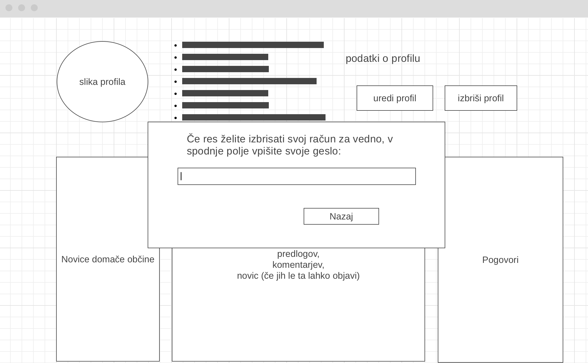
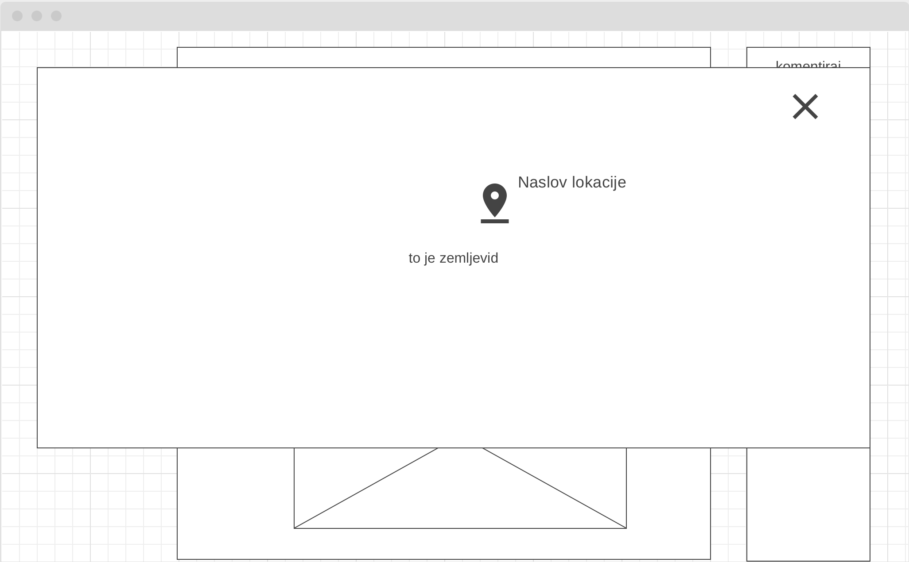

# Dokument zahtev

|                             |                                                         |
| :-------------------------- | :------------------------------------------------------ |
| **Naziv projekta**          | Občinski obveščevalnik |
| **Člani projektne skupine** | Luka Markićević, Haris Kupinić, Luka Brodnik, Elena Najdova, Luka Pantar |
| **Kraj in datum**           | Ljubljana, 28.3.2022                                   |

## Povzetek projekta

Tekom vsakdanjega življenja, marsikdo opazi napake, poškodbe in zlorabe prometnih infrastruktur ter občinskih posesti. Marsikdo se tudi spomni idej oziroma načinov kako bi lahko izboljšal vsakodnevno življenje. Zaradi kompliciranih pristopov k obveščanju občinskih delavcev se veliko teh opažanj oziroma idej ne izrazi in posledično tudi ne razreši. S skupino si želimo razviri aplikacijo, ki bi ta problem rešila in omogočala tekočo komunikacijo med občani ter občinskimi delavci. Uporabniki bi dobili obvestila o dogodkih in delih v občini kar preko aplikacije, preko nje pa bi lahko sporočali svoja mnenja in opažanja naravnost v pisarne upravnih enot. Aplikacija bi prav tako omogočala registriranim uporabnikom glasovati na predlogah njihovih so občanov. Splošne novice s strani občine bi lahko objavljal samo predstavnik občine, ki bi bil tudi zadolžen za preverjanje verodostojnosti podatkov prejetih od občanov. Pravilne podatke bi nato tudi posredoval občni organizaciji, ki bi se s predlogom oziroma problemom tudi soočila.

Na trgu že obstajajo podobne rešitve za zadan problem. Od naše aplikacije se razlikujejo, ker so predvsem namenjene določeni občini, kar pomeni da se jih ne da uporabljati vsepovsod, ali pa delujejo na obsegu celotne države, kar pa je za posamične občine neučinkovito.

## 1. Uvod

  Naša aplikacija se bo ukvarjala s problemom komunikacije med občani oziroma prebivalci in občinskimi delavci. Veliko krat se je že zgodilo da povprečen občan opazi napake oziroma poškodbe prometne in javne infrastrukture (npr. nevzdrževana cesta ali pa vandaliziran prometni znak) v svoji občini. Lahko se zgodi tudi da posameznik pride do ideje, ki bi lahko izboljšala življenje vseh prebivalcev njegove občine (npr. postavitev nove klopce v lokalnem parku). Dokler se ta opažnja problema oziroma ideja ne prijavi na upravni enoti in pride do občnega delavca, je enako, kot da je nihče ne bi zaznal oziroma si ideje izmislil. Tukaj pride do našega problema komunikacije med prebivalci in občnimi delavci. Na upravnih enotah je ponavadi potrebno čakati na prost termin, hkrati pa je kategorizacija vseh prijav odvisna od občnega delavca zadolženega za komunikacij s prebivalci. Naša rešitev je aplikacija, ki bi uporabnikom omogočila prijavo problemov ter idej, ki se navezujejo na njihovo občino, občnim delavcem pa informiranje prebivalcev s splošnimi sporočili ter kategoriziranje prijav na ideje, probleme in pa drugo.

  Uporabnike bi sprva razdelili na občne delavce in pa prebivalce. Vsi občni delavci bodo imeli sposobnost pošiljanja splošnih novic, ki jih bodo videli vsi prebivalci občine. Poseben član občnih delavcev bo predstavnik občine. Ta je zadolžen da pregleda predloge prebivalcev ter preveri njihovo pristnost. Te, ki so verodostojni nato posreduje primernim občnim organizacijam. Predstavnik občine bo imel dostop do podatkovne baze, ki bo sprejemala predloge prebivalcev. Ko bo predlog obdelal, ga bo lahko arhiviral - dodal v primarno podatkovno bazo in izbrisal iz baze za sprejem predlogov.
  
  Druga in pomembnejša skupina uporabnikov so prebivalci. Med njih spadajo navadni prebivalci (brez prijavljenega stalnega prebivališča) ter sami občani. Imeli bodo opcijo, da do aplikacije dostopajo brez registracije. Tako bodo lahko dobivali novice za občino v kateri se nahajajo, ne bodo pa mogli komunicirati z občnimi delavci ter objavljati pritožb oziroma predlogov. Druga opcija so registrirani uporabniki. Poleg dovoljenj neregistriranih uporabnikov bodo lahko sporočali pritožbe in predloge v trenutni občini ter celo komentirali novice. Za registrirane uporabnike se bo tudi vedelo, katera je njihova matična občina (glede na stalno prebivališče). V njej bodo imeli dodatne pravice kot so glasovanje o predlogih, ki jih je obdelal predstavnik občine, ter možnost najavljene komunikacije z občnimi delavci.

  Registrirani uporabniki bodo med seboj lahko tudi komunicirali ter glasovali na predlogih. Tako se bodo poamezniki, iz istih krajev, z podobnimi interesi, tudi lažje povezali. Občni delavci pa bodo s pomočjo glasovanja lahko videli, katerim predlogom se morejo posebej posvetiti in kateri niso tako pomembni.
  
  Spletna aplikacija bo delala v vseh občinah, ki jo podpirajo. Na aplikaciji se bo uporabniku (ob dovoljenju uporabljanja GPS) samodejno spreminjala občina v kateri se nahaja. Tako se bodo prijave od uporabnika navezovala na to občino. Obstajala bo tudi opcija, da pred prijavo problema oziroma ideje spremeni občino na katero se bo navezovalo.
  
  Spletna aplikacija bo imela tudi integriran dostop do Google Maps, ki se bo uporabljal med ustvarjanjem novega predloga ali novice. Tako bo lahko avtor specificiral natančno lokacijo na katero se nanaša ustvarjena novica oz. predlog. Zemljevid z lokacijo se bo nato prikazal bralcu med pregledovanjem novice oz. predloga, da bo uporabnik lahko spremljal, kje se zgodi kaj.

### 1° Zahteve izdelka:
- Sistem mora biti zmožen hkrati obdelati vsaj 200 uporabniških zahtev.
- Sistem mora odgovoriti na vsako zahtevo znotraj 1000ms.
- Sistem uporabniku ne sme omogočiti dostopa do podatkov, za katere ni izrecno pooblaščen.
- Sistem mora biti na voljo najmanj 99,9 odstotkov časa.
- Proces prijave v sistem ne sme biti daljši od 3 sekunde.
- Sistem je odporen na XSS ter SQL injection napada (merljivo z OWASP ZAP).

### 2° Organizacijske zahteve
- Procesni model bo uporabljal RUP proces.
- Sistem omogoča enostavno dodajanje novih funkcionalnostih
- Sistem bo implementiran v GIT razvojnem okolju.

### 3° Zunanje zahteve
- Sistem sledi standarde definirane po GDPR zakonu.
- Sistem se mora biti sposoben izvajati na OS Red Hat Enterprise Linux z nameščenim spletnim strežnikom Apache.
- Sistem uporablja algoritem SHA256 za enkripcijo podatkov.

## 2. Uporabniške vloge

- **Neregistriran uporabnik** - Vsak uporabnik, ki ni registriran. Neregistriran uporabnik si lahko ogleda novice, vendar ne more objavljati, pošiljati predloge in komunicirati s ostalimi uporabniki.  
- **Registriran uporabnik** - Uporabniki ki so že naredili registracijo in prijavo na spletno stran. Registrirani uporabniki lahko sledijo novice za svojo občino, pošiljajo predloge in komunicirati s ostalimi uporabniki. 
- **Občni delavec** - Občni delavci so zaposleni na občinskem uradu. Upravljateli lahko objavljajo novice, pregledajo predloge, komunicirajo z ostalimi oupravljateli in z uporabniki. 
- **Predstavnik občine** - Predstavnik občine je občni delavec, ki je zadolžen za preverjanje pristnosti predlog uporabnikov ter jih nato posreduje primernim organizacijam.
- **Administrator** - Administrator skrbi za pravilno delovanje in uporabljanje spletno stran. Lahko ogleda in briše objave in profilov. 

## 3. Slovar pojmov

- **Občina** - osnovna lokalna skupnost, ki v okviru zakonodaje samostojno ureja svoje zadeve in izvaja določene zakonske predpise na področjih, ki so ji dodeljena.
- **Prebivalec** - oseba, ki v občini živi oziroma se v njej nahaja, nima pa v njej prijavljenega stalnega prebivališča.
- **Občan** - prebivalec v občini, ki ima v njej prijavljeno stalno prebivališče.
- **Občni delavec** - oseba zaposlena na upravni enoti občine.
- **Predstavnik občine** - občni delavec zadolžen za preverjanje pristnosti in posredovanje uporabniških opažanj in priporočil.
- **Občna organizacija** - normalna organizacija, ki se nahaja v občini (npr. gasilci), če v občini ni take organizacije se nanaša na najbližjo oziroma najprimernejšo organizacijo izven občine.
- **XSS napadi** - križno izvajanje skriptov (Cross-Site Scripting), omogočajo napadalcem, da vnesejo skripte na strani odjemalca v spletne strani, ki si jih ogledujejo drugi uporabniki.
- **RUP proces** - RUP oz. Rational Unified Process predstavlja iterativen proces razvoja programske opreme.
- **GIT okolje** - odprtokodni sistem za upravljanje z izvorno kodo.

## 4. Diagram primerov uporabe

:dart: **TO-DO**

- Narišite diagram primerov uporabe v jeziku UML.
- Diagram predstavlja interakcijo med akterji in funkcionalnostmi (kdo lahko kaj počne).
- Akterji so tipično uporabniške vloge, lahko pa gre tudi za zunanje komponente (sistemi), ki komunicirajo z našo aplikacijo.
- Za izdelavo uporabite ogrodje PlantUML, in sicer [Use Case Diagram](https://plantuml.com/use-case-diagram).
- V poročilo vključite **izvorno kodo diagrama v jeziku PlantUML**, ki naj bo prisotna v repozitoriju, sliko diagrama pa vključite s povezavo (in ne preko neposredne vključitve binarne datoteke) preko storitve [`https://teaching.lavbic.net/plantuml`](https://teaching.lavbic.net/plantuml), kot prikazuje spodnji primer.
- Diagram naj bo **jasno berljiv**.

**Diagram primerov uporabe** (izvorna koda :bar_chart: [PlantUML](../gradivo/plantuml/DPU.puml))

## 5. Funkcionalne zahteve

1. Registracija
2. Prijava
3. Odjava
4. Pregled uporabniškega profila
5. Ureditev profila
6. Brisanje profila
7. Dodajanje novic o dogodkih, spremembah v občini, aktualnih dogajanj...
8. Urejanje novic
9. Brisanje novic
10. Pregled novic
11. Dodajanje predlogov o odpravljanju poškodb, novih idej, težavah... 
12. Glasovanje med predlogi
13. Urejanje predlogov
14. Pregled predlogov
15. Brisanje predlogov
16. Pošiljanje sporočil
17. Iskanje novice/predlogov
18. Pregled profilov ostalih uporabnikov
19. Dodajanje komentarja
20. Brisanje komentarja
21. Izbira lokacije
22. Ogled lokacije

## 1. Registracija
Neregistriran uporabnik lahko registrira račun, kar predstavlja osnovno funkcionalnost za omogočanje polne izkušnje pri uporabi naše aplikacije. Po izpolnjeni registracijski formi in uspešni registraciji, uporabnik si bo ustvaril račun s pomočjo, katerega bo lahko dostopal do različnih vsebin in funkionalnosti aplikacije.

#### Osnovni tok

1. Neregistriran uporabnik lahko izbere gumb za registracijo.
2. Uporabnik dobi registracijski obrazec
3. Uporabnik izpolni osebne podatke
4. Uporabnik izbere občino, v kateri živi
5. Uporabnik odda vlogo za registracijo
6. Uporabnik prejme potrdilo o uspešni registraciji

#### Alternativni tok 1

1. Neregistriran uporabnik lahko izbere gumb za registracijo.
2. Uporabnik dobi registracijski obrazec
3. Uporabnik neustrezno izpolni osebne podatke
4. Uporabnik izbere občino v kateri živi
5. Uporabnik odda vlogo za registracijo
7. Uporabnik dobi obvestilo da so podatki neustrezno izpolnjeni in zavrne registracijo

#### Alternativni tok 2

1. Registriran uporabnik lahko izbere gumb za registracijo.
2. Uporabnik dobi registracijski obrazec
3. Uporabnik izpolni osebne podatke
4. Uporabnik izbere občino, v kateri živi
5. Uporabnik odda vlogo za registracijo
7. Uporabnik dobi obvestilo da je uporabnik že registriran in zavrne registracijo

#### Pogoji

Uporabnik ne sme biti že registriran.
Ne obstaja uporabnik z istimi osebnimi podatki.

#### Posledice

Ob uspešni registraciji, se v bazi doda nov račun. Registriran uporabnik lahko nadaljuje s prijavo in dostopa do ostalih funkcionalnosti.

#### Posebnosti

- Geslo mora biti sestavljeni iz vsaj 8 znakov, vsebovati mora vsaj eno številko in znak
- Vsi podatki so shranjeni u skladu z varstvom osebnih podatkov v EU

#### Prioritete identificiranih funkcionalnosti

Funkcionalnost spada pod MUST have prioriteto, saj brez možnosti registracije aplikacija nima uporabnikov.

- Za identificirane funkcionalnosti se z metodo **MoSCoW** (MUST have, SHOULD have, COULD have in WOULD have) določi prioritete.

#### Sprejemni testi 

| Primer uporabe | Funkcija, ki se testira | Začetno stanje sistema | Vhod | Pričakovan rezultat |
| --- | --- | --- | --- | --- |
| Registracija | Samostalna registracija uporabnika | Uporabnik še ni registriran | Vnos podatkov za registracijo | Uspešno registriran uporabnik vpisan v podatkovno bazo |
| Registracija | Administratorska registracija uporabnika | Uporabnik še ni registriran | Vnos podatkov za registracijo | Uspešno registriran uporabnik vpisan v podatkovno bazo |
| Registracija | Sporočanje o nepravilni registraciji | Uporabnik še ni registriran | Vnos pomanjkljivih podatkov za registracijo | Obvestilo o neuspešna registraciji uporabnika |
| Registracija | Zahteva po vsemi podatki | Uporabnik še ni registriran | Vnos vseh podatkov za registracijo razen občine | Obvestilo o neuspešna registraciji uporabnika |
| Registracija | Uporabnik že obstaja | Uporabnik je že registriran | Vnos podatkov za registracijo | Obvestilo o neuspešni registraciji uporabnika |

## 2. Prijava
Registiran uporabnik, občni delavec, predstavnik občine ter administrator lahko s procesom prijave dostopajo do svojih računov in vseh funkcionalnosti, ki jih njihova vloga omogoča.

#### Osnovni tok

1. Uporabnik izbere gumb za prijavo
2. Uporabnik dobi prijavni obrazec
3. Uporabnik izpolni obrazec s email-om in geslom
4. Uporabnik odda obrazec
5. Uporabnik ob uspešni prijavi dobi začetno stran
6. Uporabnik lahko uporablja funkcionalnosti glede njegovo vlogo

#### Alternativni tok 1

1. Registriran uporabnik izbere gumb za prijavo
2. Registriran uporabnik dobi prijavni obrazec
3. Registriran uporabnik napačno izpolni obrazec z email-om in geslom
4. Registriran uporabnik odda obrazec
5. Registriran uporabnik dobi obvestilo da je email ali geslo napačno in je prijava zavrnjena

#### Pogoji

Uporabnik je že registriran in ni prijavljen. 

#### Posledice

Ob prijavi, uporabnik lahko uporablja funkcionalosti glede njegovo vlogo. Registriran uporabnik lahko pregleda/objavlja/briše predloge, bere novice, komenitra, glasuje, uredi svoj profil. Administrator lahko pregleda in briše predloge in novice, pa tudi poregleda/spremeni/briše uporabniške račune. Občni delavec lahko doda/spemeni/briše novice in pregleda predloge. Pretstavnik občine lahko obdela predloge in novice.

#### Posebnosti

Ni posebnosti.

#### Prioritete identificiranih funkcionalnosti

Prijava spada pod MUST have prioriteto, saj brez prijavo uporabniki ne morejo dostopat do funkcionalnosti.

#### Sprejemni testi

| Primer uporabe | Funkcija, ki se testira | Začetno stanje sistema | Vhod | Pričakovan rezultat |
| --- | --- | --- | --- | --- |
| Prijava | Prikaz prijavne forme | Registriran uporabnik na začetni strani | Izbira gumba za prijavo | Uspešno prikazana prijavna stran |
| Prijava | Prijava uporabnika | Registriran uporabnik na prijavni strani | Vnos podatkov za prijavo | Uspešno prijavljen uporabnik |
| Prijava | Neobstoječa stran zaradi tehničnih težav | Registriran uporabnik na začetni strani | Izbira gumba za prijavo | Obvestilo o neuspešnem nalaganju prijavne strani |
| Prijava | Napačni podatki za prijavo | Registriran uporabnik na prijavni strani | Vnos napačnih podatkov za prijavo | Obvestilo o neuspešni prijavi |

## 3. Odjava
Registiran uporabnik, občni delavec, predstavnik občine ter administrator se lahko tudi odjavijo iz svojega računa ter aplikaciji pristopijo kot gostje.

#### Osnovni tok

1. Prijavljen uporabnik izbere gumb za odjavo
2. Uporabnik potrdi odjavo
3. Uporabnik je odjavljen iz sistema

#### Alternativni tok(ovi)

Ni alternativnih tokov.

#### Pogoji

Uporabnik mora biti prijavljen.

#### Posledice

Uporabnik je odjavljen iz sistema in lahko uporablja aplikacijo kot neregistrirani uporabnik.

#### Posebnosti

Ni posebnosti.

#### Prioritete identificiranih funkcionalnosti

Funkcionalnost ima MUST have prioriteto, da se lahko drug uporabnik prijavi v aplikacijo.

#### Sprejemni testi

| Primer uporabe | Funkcija, ki se testira | Začetno stanje sistema | Vhod | Pričakovan rezultat |
| --- | --- | --- | --- | --- |
| Odjava | Lastnoročno odjavljanje iz sistema | Prijavljen uporabnik | Izbira gumba za odjavo | Uporabnik je odjavljen iz sistema |
| Odjava | Administratorska odjava iz sistema | Prijavljen uporabnik | Administratorska izbira uporabnika za odjavo | Uporabnik je odjavljen iz sistema |

## 4. Pregled uporabniškega profila
Registriran uporabnik, občni delavec, predstavnik občine in administrator lahko pregledajo svoj račun ter informacije, ki jih delijo z drugimi.

#### Osnovni tok

1. Uporabnik izbere gumb za pregled profila
2. Uporabniku se prikaže njegov profil kjer lahko pregleda svoje osebne podatke, izbrano občino, objavljene novice/predloge/komentarje in svoja sporočila

#### Alternativni tok(ovi)

Ni alternativnih tokov.

#### Pogoji

Uporabnik mora biti prijavljen.

#### Posledice

Uporabnik lahko pregleda svoj profil in vse kar je povezano z njim.

#### Posebnosti

Ni posebnosti.

#### Prioritete identificiranih funkcionalnosti

Funkcionalnost ima SHOULD have prioriteto. Spletna stran bo še vedno delovala brez pregleda profila, vendar otežuje uporabo aplikacijo. 

#### Sprejemni testi

| Primer uporabe | Funkcija, ki se testira | Začetno stanje sistema | Vhod | Pričakovan rezultat |
| --- | --- | --- | --- | --- |
| Pregled uporabniškega profila | Pregled lastnega profila | Prijavljen uporabnik | Izbira gumba za prikaz profila | Uspešno prikazan lastni profil |
| Pregled uporabniškega profila | Administratorski pregled tujega profila | Administrator prijavljen v aplikacijo | Izbira gumba za prikaz uporabnikovega profila | Uspešno prikazan profila uporabnika |

## 5. Ureditev profila
Registriran uporabnik, občni delavec, predstavnik občine in administrator lahko urejajo svoj profil ter posodabljajo osnovne informacije, kot so ime, priimek, geslo, itn.

#### Osnovni tok

1. Uporabnik izbere gumb za pregled profila
2. Uporabniku se prikaže njegov profil
3. Uporabnik izbere gumb za spremembo podatkov
4. Uporabnik izpolni obrazec z novimi podatki
5. Uporabnik odda obrazec
6. Ob uspešni spremembi, se uporabniku prikaže njegov profil s spremenjenimi podatki

#### Alternativni tok 1

1. Administrator izbere uporabniški profil
2. Administrator izbere gumb za spremembo profila
3. Administrator izpolni obrazec z novimi podatki
4. Administrator odda obrazec
5. Ob uspešni spremembi, se administratoru prikaže izbran profil s spremenjenimi podatki

#### Alternativni tok 2

1. Uporabnik izbere gumb za pregled profila
2. Uporabniku se prikaže njegov profil
3. Uporabnik izbere gumb za spremembo podatke
4. Uporabnik izpolni obrazec z neustreznimi podatki
5. Uporabnik odda obrazec
6. Uporabniku se prikaže obvestilo o neuspešni spremembi

#### Pogoji

Uporabnik mora biti prijavljen.

#### Posledice

Spremenjen profil.

#### Posebnosti

Ni posebnosti.

#### Prioritete identificiranih funkcionalnosti

Funkcionalnost ima SHOULD have prioriteto. Aplikacija bo delovala brez nje, vendar spreminjanje podatkov postane zelo neunčikovito.

#### Sprejemni testi

| Primer uporabe | Funkcija, ki se testira | Začetno stanje sistema | Vhod | Pričakovan rezultat |
| --- | --- | --- | --- | --- |
| Urejanje profila | Spreminjanje priimka | Prijavljen uporabnik na strani svojega profila s trenutnim priimkom | Izbira gumba za urejanje profila ter vnos novega priimka | Stran uporabniškega profila z novim priimkom | 
| Urejanje profila | Spreminjanje gesla | Prijavljen uporabnik na strani svojega profila s trenutnim geslom | Izbira gumba za urejanje profila ter vnos novega gesla | Stran uporabniškega profila z novim geslom | 
| Urejanje profila | Dostop do funkcionalnosti spreminjanja tujega računa | Administrator na uporabnikovemu profilu | Izbira gumba za urejanje profila | Forma za vnos novih podatkov |
| Urejanje profila | Administratorsko spreminjanje tujega računa | Forma za vnos novih podatkov | Vnos spremenjenih podatkov | Obvestilo o uspešni spremembi | 
| Urejanje profila | Neustrezni podatki | Prijavljen uporabnik na strani svojega profila | Izbira gumba za urejanje profila ter vnos neustreznih podatkov | Prikaz obvestila o neuspešni spremembi |
| Urejanje profila | Nedelovanje oddaje | Prijavljen uporabnik na strani svojega profila | Izbira gumba za urejanje profila ter vnos neustreznih podatkov | Prikaz obvestila o neuspešni spremembi |

## 6. Brisanje profila
Registriran uporabnik, občni delavec, predstavnik občine in administrator lahko izbrišejo svoj račun. Razlogov zato je kar nekaj - selitev, prenehanje funkcije v občini, itn.

#### Osnovni tok

1. Uporabnik izbere gumb za pregled profila
2. Uporabniku se prikaže njegov profil
3. Uporabnik izbere gumb za brisanje profila
5. Uporabnik potrdi brisanje profila
6. Profil je zbrisan in uporabniku se odpre začetno stran

#### Alternativni tok

1. Administrator izbere uporabniški profil
2. Administrator izbere gumb za brisanje profila
3. Administrator potrdi brisanje profila
4. Ob uspešno brisanje, se administratoru prikaže začetno stran

#### Pogoji

Uporabnik mora biti prijavljen.

#### Posledice

Profil je izbrisan iz podatkovne baze.

#### Posebnosti

Ni posebnosti.

#### Prioritete identificiranih funkcionalnosti

Funkcionalnost ima MUST have prioriteto. Če uporabnik lahko ustavi nov profil, potem mora imeti možnost tudi da ga izbriše.

#### Sprejemni testi

| Primer uporabe | Funkcija, ki se testira | Začetno stanje sistema | Vhod | Pričakovan rezultat |
| --- | --- | --- | --- | --- |
| Brisanje profila | Prikaz sporočila o potrditvi brisanja | Prijavljen uporabnik na svojemu profilu | Izbira gumba za brisanje profila | Sporočilo o potrditvi akcije |
| Brisanje profila | Prikaz sporočila o potrditvi brisanja | Prijavljen uporabnik na svojemu profilu | Izbira gumba za potrditev brisanje profila | Zbrisan profil uporabnika in odprta začetna stran |
| Brisanje profila | Administratorsko brisanje profila | Administrator na profilu uporabnika | Izbira gumba za brisanje profila | Zbrisan profil uporabnika in odprta začetna stran |
| Brisanje profila | Ohranjanje uporabnika v sistemu po zavrnitvi brisanja | Administrator na profilu uporabnika | Izbira gumba za preklic akcije brisanja | Uporabnik še vedno prisoten v bazi |

## 7. Dodajanje novic o dogodkih, spremembah v občini, aktualnih dogajanj...
Občni delavec in predstavnik občine lahko dodajajo novice o trenutnih dogajanj v občini. S promocijo dogodkov in del v občini, promovirajo tudi svoje delo in pa tudi obveščajo stanovalce o vseh aktualnostih.

#### Osnovni tok

1. Občni delavec, predstavnik občine ali administrator izbere gumb za dodajanje novice
2. Občni delavec, predstavnik občine ali administrator napiše novico in zahtevane podatke v prikazanem obrazec
3. Občni delavec, predstavnik občine ali administrator izbere gumb za objavo
4. Ob uspečni objavi, je novica prikzana med novicami in se uporabniku prikaže začetno stran

#### Alternativni tok 1

1. Občni delavec ali predstavnik občine izbere gumb za dodajanje novice
2. Občni delavec ali predstavnik občine neustrezno izpolni zahtevane podatke v prikazanem obrazecu
3. Občni delavec ali predstavnik dobi obvestilo o neuspešni objavi

#### Pogoji

Občni delavec ali predstavnik občine mora biti prijavljen.

#### Posledice

Dodana novica v podatkovni bazi.

#### Posebnosti

Ni posebnosti.

#### Prioritete identificiranih funkcionalnosti

Funkcionalnost ima MUST have prioriteto, ker to je glavni namen spletno strani.

#### Sprejemni testi

| Primer uporabe | Funkcija, ki se testira | Začetno stanje sistema | Vhod | Pričakovan rezultat |
| --- | --- | --- | --- | --- |
| Dodajanje nove vsebine | Prikaz forme za dodajanje vsebine | Začetna stran | Izbira gumba za dodajanje vsebine | Odprta forma za dodajanje vsebine |
| Dodajanje nove vsebine | Dodajanje vsebine | Forma za dodajanje vsebine | Nova vsebina in izbira gumba za objavo | Nova vsebina dodana med že obstoječo vsebino |
| Dodajanje nove vsebine | Neobstoječa stran zaradi tehničnih težav | Stran z vsebino | Izbira gumba za dodajenj vsebine | Obvestilo o neuspešni naloženi formi |
| Dodajanje nove vsebine | Neustrezno dodajanje vsebine | Stran z vsebino | Nova vsebina z neustrezno izpolnjenimi podatki | Obvestilo o neuspešni objavi |

## 8. Urejanje novic
Občni delavec in predstavnik občine lahko urejata objavljenje novice. To je lahko potrebno zgolj zaradi manjše pravopisne napake ali pa kakšne bolj resne spremembe.

#### Osnovni tok

1. Občni delavec, predstavnik občine ali administrator izbere in odpre novico
2. Občni delavec, predstavnik občine ali administrator izbere gumb za ureditev novico
3. Občni delavec, predstavnik občine ali administrator izpolni zahtevane podatke v prikazanem obrazecu
4. Občni delavec, predstavnik občine ali administrator odda obrazec
5. Ob uspešni spremembi, uporabniku se prikaže začetno stran

#### Alternativni tok

1. Občni delavec, predstavnik občine ali administrator izbere in odpre novico
2. Občni delavec, predstavnik občine ali administrator izbere gumb za ureditev novico
3. Občni delavec, predstavnik občine ali administrator neustrezno izpolni zahtevane podatke v prikazanem obrazecu
4. Občni delavec, predstavnik občine ali administrator odda obrazec
5. Uporabniku dobi obvestilo o neuspešni spremembi

#### Pogoji

Občni delavec, predstavnik občine ali administrator mora biti prijavljen.

#### Posledice

Novica je spremenjena.

#### Posebnosti

Ni posebnosti.

#### Prioritete identificiranih funkcionalnosti

Funkcionalnost ima SHOULD have prioriteto. Spletna stran bo delovaval tudi brez nje, vendar veliko izboljšuje uporabniško izkušnjo.

#### Sprejemni testi

| Primer uporabe | Funkcija, ki se testira | Začetno stanje sistema | Vhod | Pričakovan rezultat |
| --- | --- | --- | --- | --- |
| Urejanje novic | Delovanje gumba za urejanje novic | Stran z vsebino | Izbira gumba za ureditev določene novice | Prikazana forma za urejanje |
| Urejanje novic | Urejanje vsebine | Forma za urejanje | Vnos in oddaja novih podatkov | Prikazana začetna stran |
| Urejanje novic | Neuspešno urejanje vsebine | Forma za urejanje | Vnos in oddaja neustreznih podatkov | Obvestilo o neuspešni spremembi |
| Urejanje novic | Neuspešna oddaja obrazca | Forma za urejanje | Izbira gumba za oddajo sprememb | Obvestilo o neuspešni spremembi |

## 9. Brisanje novic
Občni delavec, predstavnik občine in administrator lahko tudi pobrišeta novice, kar je izjemno koristno v primeru, da ugotovita, da je novica napačna ali pa, da je prišlo do neke spremembe.

#### Osnovni tok

1. Občni delavec, predstavnik občine ali administrator izbere gumb za pregled svojega profila
2. Občni delavec, predstavnik občine ali administrator izbere novico, ki jo je sam objavil
3. Občni delavec, predstavnik občine ali administrator izbere gumb za brisanje novico
4. Občni delavec, predstavnik občine ali administrator potrdi brisanje novico
5. Občni delavec, predstavnik občine ali administrator dobi obvestilo o uspešnem brisanju

#### Alternativni tok 1

1. Predstavnik občine ali administrator izbere novico za pregled iz seznama vseh novic
3. Predstavnik občine ali administrator izbere gumb za brisanje novice
4. Predstavnik občine ali administrator potrdi brisanje novice
5. Predstavnik občine ali administrator dobi obvestilo o uspešnem brisanju

#### Pogoji

Občni delavec, predstavnik občine ali administrator mora biti prijavljen.

#### Posledice

Novica je izbrisana iz podatkovne baze.

#### Posebnosti

Ni posebnosti.

#### Prioritete identificiranih funkcionalnosti

Funkcionalnost ima SHOULD have prioriteto. Spletna stran bo delovala tudi brez te funkcionalnosti, vendar je pomembna v primeru da je novica napačna ali pa, da je prišlo do neke spremembe.

#### Sprejemni testi

| Primer uporabe | Funkcija, ki se testira | Začetno stanje sistema | Vhod | Pričakovan rezultat |
| --- | --- | --- | --- | --- |
| Brisanje novic | Delovanje gumba za brisanje novice | Lastni profil uporabnika | Izbira gumba za brisanje določene lastne novice | Sporočilo o potrditvi brisanja |
| Brisanje novic | Brisanje lastne novice | Sporočilo o potrditvi brisanja | Izbira gumba za potrditev brisanja | Obvestilo o uspešnem brisanju |
| Brisanje novic | Delovanje gumba za brisanje novice | Stran z vsebino | Izbira gumba za brisanje določene novice | Sporočilo o potrditvi brisanja |
| Brisanje novic | Brisanje tuje novice | Sporočilo o potrditvi brisanja | Potrditev brisanja | Obvestilo o uspešnem brisanju |

## 10. Pregled novic
Registriran uporabnik, občni delavec, predstavnik občine in administrator lahko pregledujejo novice o aktualnih dogajanj v občini, del, aktivnosti, ipd.

#### Osnovni tok

1. Uporabnik odpre začetno stran
2. Uporabnik izbere novico, ki ga zanima
3. Uporabniku se prikažejo informacije o novici in komentarji

#### Alternativni tok

Ni alternativnih tokov.

#### Pogoji

Ni pogoji.

#### Posledice

Uporabnik pregleda novico.

#### Posebnosti

Ni posebnosti.

#### Prioritete identificiranih funkcionalnosti

Funkcionalnost ima MUST have funkcionalnost. Spletna stran ne bo uporabna brez pregleda novic.

#### Sprejemni testi

| Primer uporabe | Funkcija, ki se testira | Začetno stanje sistema | Vhod | Pričakovan rezultat |
| --- | --- | --- | --- | --- |
| Pregled novic | Prikaz novice | Začetna stran | Izbira novice | Prikaz dodatnih informacij o izbrani novici |
| Pregled novic | Prikaz komentarja | Začetna stran | Izbira novice | Prikaz dodatnih komentarjev na izbrani novici |

## 11. Dodajanje predlogov o odpravljanju poškodb, novih idej, težavah...
Registrirani uporabniki lahko dodajajo predloge, kako bi popravili neko poškodbo, kaj bi radi imeli v svoji občini ali pa kako bi odpravili neko težavo.

#### Osnovni tok

1. Registrirani uporabnik izbere gumb za dodajanje predloga
2. Registrirani uporabnik napiše predlog in zahtevane podatke v prikazanem obrazec
3. Registrirani uporabnik izbere gumb za objavo
4. Ob uspešni objavi, je predlog prikazan med predlogami in se uporabniku prikaže začetno stran

#### Alternativni tok

1. Registrirani uporabnik izbere gumb za dodajanje predlog
2. Registrirani uporabnik neustrezno izpolni zahtevane podatke v prikazanem obrazec
3. Registrirani uporabnik izbere gumb za objavo
4. Uporabniku se prikaže obvestilo o neuspešno objavo

#### Pogoji

Uporabnik mora biti prijavljen.

#### Posledice

Predlog je dodan v podatkovni bazi.

#### Posebnosti

Ni posebnosti.

#### Prioritete identificiranih funkcionalnosti

Funkcionalnost ima MUST have prioriteto, ker to je to ena od najbolj pomembnih funkcionalnosti.

#### Sprejemni testi

| Primer uporabe | Funkcija, ki se testira | Začetno stanje sistema | Vhod | Pričakovan rezultat |
| --- | --- | --- | --- | --- |
| Dodajanje predlogov | Prikaz forme za dodajanje predloga | Začetna stran | Izbira gumba za dodajanje predlogov | Prikaz forme za vnos podatkov |
| Dodajanje predlogov | Prikaz forme za dodajanje predloga | Prikaz forme za vnos podatkov | Vnos in oddaja podatkov | Prikaz novega predloga na začetni strani |
| Dodajanje predlogov | Neustreznost podatkov | Začetna stran | Izbira gumba za dodajanje predlogov ter vnos in oddaja neustreznih podatkov | Prikaz obvestila o neuspešni objavi |
| Dodajanje predlogov | Delovanje gumba za oddajo | Prikaz forme za vnos podatkov | Izbira gumba za oddajo | Prikaz obvestila o neuspešni objavi |

## 12. Glasovanje med predlogi
Registrirani uporabniki lahko glasujejo med predlogi, izbirajo tistega, ki njim najbolj ustreza in ki bo bil v največji meri pomagal prosperitetu občine.

#### Osnovni tok

1. Registriran uporabnik izbere predlog
3. Registriran uporabnik pregleda predlog
4. Registriran uporabnik glasuje za ali proti predlogu
5. Registriran uporabnik dobi obvestilo o uspešno glasovanje

#### Alternativni tok

Ni alternativnih tokov.

#### Pogoji

Uporabnik mora biti prijavljen.

#### Posledice

Število glasov predloga se poveča oz. zmanjša.

#### Posebnosti

Ni posebnosti.

#### Prioritete identificiranih funkcionalnosti

Funkcionalnost ima COULD have prioriteto. Spletna stran bo delovala in bo koristna tudi brez nje, vendar izboljšuje uporabniško izkušnjo.

#### Sprejemni testi

| Primer uporabe | Funkcija, ki se testira | Začetno stanje sistema | Vhod | Pričakovan rezultat |
| --- | --- | --- | --- | --- |
| Glasovanje za predloge | Oddaja glasa za predlog | Predlog s trenutnim številom ZA glasov | Glas za predlog | Obvestilo o uspešnem glasovanju |
| Glasovanje za predloge | Oddaja glasa proti predlogu | Predlog s trenutnim številom PROTI glasov | Glas proti predlogu | Obvestilo o uspešnem glasovanju |

## 13. Urejanje predlogov
Registriran uporabnik (avtor predloga) in administrator lahko urejajo predloge, kar bo še posebej koristno za boljše oblikovanje cilja predlogov, odpravljanje pravopisnih napak, ipd.

#### Osnovni tok

1. Registriran uporabnik odpre svoj profil
2. Registriran uporabnik izbere predlog, ki ga želi spremeniti in gumb za spremembo
3. Registriran uporabnik izpolni zahtevane podatke v prikazanem obrazecu
4. Registriran uporabnik odda obrazec
5. Ob uspešni spremembi, uporabniku se prikaže začetno stran

#### Alternativni tok

1. Administrator izbere predlog in gumb za spremembo
3. Administrator izpolni zahtevane podatke v prikazanem obrazecu
4. Administrator odda obrazec
5. Ob uspešni spremembi, uporabniku se prikaže začetno stran

#### Pogoji

Uporabnik mora biti prijavljen.

#### Posledice

Predlog je spremenjen.

#### Posebnosti

Ni posebnosti.

#### Prioritete identificiranih funkcionalnosti

Funkcionalnost ima SHOULD have prioriteto. Spletna stran bo delovala tudi brez nje, vendar veliko izboljšuje uporabniško izkušnjo.

#### Sprejemni testi

| Primer uporabe | Funkcija, ki se testira | Začetno stanje sistema | Vhod | Pričakovan rezultat |
| --- | --- | --- | --- | --- |
| Urejanje predlogov | Sprememba opisa predloga | Lastni profil uporabnika | Izbira gumba za urejanje lastnega predloga ter vnos in oddaja novih podatkov | Začetna stran |
| Urejanje predlogov | Sprememba lokacije predloga | Lastni profil uporabnika | Izbira gumba za urejanje lastnega predloga ter vnos in oddaja novih podatkov | Začetna stran |
| Urejanje predlogov | Delovanje gumba za urejanje | Profil uporabnika | Izbira gumba za urejanje predloga | Prikaz vnosne forme |
| Urejanje predlogov | Administratorsko urejanje | Prikaz vnosne forme na profilu uporabnika | Izbira gumba za urejanje predloga ter vnos in oddaja novih podatkov | Začetna stran |

## 14. Pregled predlogov
Registriran uporabnik, občni delavec, predstavnik občine in administrator lahko pregledajo predloge in na podlagi tega vpogleda formirajo svoje mnenje o le-tem.

#### Osnovni tok

1. Uporabnik odpre začetno stran
2. Uporabnik izbere predlog, ki ga zanima
3. Uporabniku se prikažejo informacije o predlogu, njegovi glasovi in komentarji

#### Alternativni tok(ovi)

Ni alternativnih tokov.

#### Pogoji

Ni pogoji.

#### Posledice

Uporabniku se prikaže predlog.

#### Posebnosti

Ni posebnosti.

#### Prioritete identificiranih funkcionalnosti

Funkcionalnost ima MUST have funkcionalnost. Spletna stran ne bo uporabna brez pregleda predlogov.

#### Sprejemni testi

| Primer uporabe | Funkcija, ki se testira | Začetno stanje sistema | Vhod | Pričakovan rezultat |
| --- | --- | --- | --- | --- |
| Pregled predlogov | Prikaz informacij o predlogu | Začetna stran s predlogi | Izbira predloga | Prikaz informacij o predlogu |
| Pregled predlogov | Prikaz glasov predloga | Začetna stran s predlogi | Izbira predloga | Prikaz glasov za/proti predlogu |

## 15. Brisanje predlogov
Registriran uporabnik (autor predloga), predstavnik občine in administrator lahko brišejo predloge, za katere menijo, da ne ustrezajo standardom in pogojem uporabe aplikacije.

#### Osnovni tok

1. Registriran uporabnik izbere gumb za pregled svojega profila
2. Registriran uporabnik izbere predlog, ki ga je sam objavil
3. Registriran uporabnik izbere gumb za brisanje predloga
4. Registriran uporabnik potrdi brisanje predloga
5. Registriran uporabnik dobi obvestilo o uspešnem brisanju

#### Alternativni tok

1. Predstavnik občine ali administrator izbere predlog za pregled iz seznama vseh predlogov
3. Predstavnik občine ali administrator izbere gumb za brisanje predloga
4. Predstavnik občine ali administrator potrdi brisanje predloga
5. Predstavnik občine ali administrator dobi obvestilo o uspešnem brisanju

#### Pogoji

Uporabnik mora biti prijavljen.

#### Posledice

Predlog je izbrisan iz podatkovne baze.

#### Posebnosti

Ni posebnosti.

#### Prioritete identificiranih funkcionalnosti

Funkcionalnost ima SHOULD have prioriteto. Spletna stran bo delovala tudi brez te funkcionalnosti, vendar je pomembna v primeru da je prelog neprimeren.

#### Sprejemni testi

| Primer uporabe | Funkcija, ki se testira | Začetno stanje sistema | Vhod | Pričakovan rezultat |
| --- | --- | --- | --- | --- |
| Brisanje predlogov | Potrditev brisanja | Predlog v bazi | Izbira gumba za brisanje lastnega predloga | Sporočilo o potrditvi brisanja |
| Brisanje predlogov | Brisanje predloga | Predlog v bazi | Potrditev akcije brisanja | Obvestilo u uspešnem brisanju in zbrisan predlog iz baze |
| Brisanje predlogov | Prikaz opcije brisanja tujih predlogov | Predlog v bazi | Izbira gumba za brisanje  predloga | Sporočilo o potrditvi brisanja |
| Brisanje predlogov | Brisanje tujega predloga | Predlog v bazi | Potrditev brisanja predloga | Obvestilo u uspešnem brisanju in zbrisan predlog iz baze |

## 16. Pošiljanje sporočil
Registriran uporabnik, občni delavec, predstavnik občine in administrator si lahko izmenjujejo sporočila med sabo, kar bo močno olajšalo povezovanje in komunikacijo članov občine.

#### Osnovni tok

1. Uporabnik odpre profil drugega uporabnika
2. Uporabnik izbere gumb za pošiljanje sporočila
3. Uporabnik izpolni vnosno polje za sporočila
4. Uporabnik pošlje sporočilo
5. Uporabnik dobi obvestilo da je sporočilo poslano

#### Alternativni tok

Ni alternativnih tokov.

#### Pogoji

Uporabnik mora biti prijavljen.

#### Posledice

Sporočilo je poslano.

#### Posebnosti

Ni posebnosti.

#### Prioritete identificiranih funkcionalnosti

Funkcionalnost ima WOULD have prioriteto. Funkcionalnost ni potrebna, vendar je komunikacija med uporabniki zaželjena.

#### Sprejemni testi

| Primer uporabe | Funkcija, ki se testira | Začetno stanje sistema | Vhod | Pričakovan rezultat |
| --- | --- | --- | --- | --- |
| Pošiljanje sporočil | Delovanje gumba za prikaz forme | Profil drugega uporabnika | Izbira gumba za prikaz forme za pošiljanje sporočil | Prikazana forma za pošiljanje sporočil |
| Pošiljanje sporočil | Pošiljanje sporočila | Profil drugega uporabnika | Vnos ter pošiljanje sporočila | Obvestilo o poslanemu sporočilu |

## 17. Iskanje novic/predlogov
Registriran uporabnik, občni delavec, predstavnik občine in administrator lahko iščejo novice in predloge, ki jih zanimajo. Na ta način bodo hitreje dostopali do zase koristnih vsebin.

#### Osnovni tok

1. Uporabnik izbere vnosno polje za iskanje.
2. Uporabnik vnese iskalni izraz.
3. Uporabniku se prikažejo zadetki iskanja.

#### Alternativni tok

Ni alternativnih tokov.

#### Pogoji

Ni pogojev.

#### Posledice

Uporabnik dobi rezultata iskanja.

#### Posebnosti

Ni posebnosti.

#### Prioritete identificiranih funkcionalnosti

Funkcionalnost ima WOULD have prioriteto. Uporabnik si lahko tudi brez te funkcionalnosti ogleda vse novice in predloge.

#### Sprejemni testi

| Primer uporabe | Funkcija, ki se testira | Začetno stanje sistema | Vhod | Pričakovan rezultat |
| --- | --- | --- | --- | --- |
| Iskanje novic/predlogov | Iskanje obstoječe novice/predloga | Baza, ki vsebuje iskano novico/predlog | Vnos iskalnega izraza | Prikaz zadetkov iskanja |
| Iskanje novic/predlogov | Iskanje neobstoječe novice/predloga | Baza, ki ne vsebuje iskano novico/predlog | Vnos iskalnega izraza | Prikaz sporočila o neobstoju ujemanja |

## 18. Pregled profilov ostalih uporabnikov
Registriran uporabnik, občni delavec, predstavnik občine in administrator lahko pregledujejo profile ostalih uporabnikov in na ta način lažje ustvarijo interakcijo med sabo.

#### Osnovni tok

1. Uporabnik izbere in odpre željen profil
2. Uporabnik lahko pregleda podatke in objavljene novice oz. predloge izbranega profila

#### Alternativni tok

Ni alternativnih tokov.

#### Pogoji

Ni pogojev.

#### Posledice

Uporabnik pregleda profil drugega uporabnika.

#### Posebnosti

Ni posebnosti.

#### Prioritete identificiranih funkcionalnosti

Funkcionalnost ima SHOULD have prioriteto. Vzpostavljanje lažje interakcije med uporabniki ni ena izmed glavnik funkcij aplikacije.

#### Sprejemni testi

| Primer uporabe | Funkcija, ki se testira | Začetno stanje sistema | Vhod | Pričakovan rezultat |
| --- | --- | --- | --- | --- |
| Pregled profilov ostalih uporabnikov | Prikaz objav na tujem profilu | Začetna stran | Izbira profila drugega uporabnika | Prikazane objave drugega uporabnika |
| Pregled profilov ostalih uporabnikov | Prikaz podatkov o tujem profilu | Začetna stran | Izbira profila drugega uporabnika | Prikazani podatki  drugega uporabnika |

## 19. Dodajanje komentarja
Registriran uporabnik, občni delavec, predstavnik občine in administrator lahko komentirajo predloge/novice, kar bo prispevalo k lažjemu razumevanju ter hitrejši izmenjavi informacij, ki lahko koristijo večjem številu ljudi.

#### Osnovni tok

1. Uporabnik izbere predlog/novico
2. Uporabnik v vnosno polje napiše komentar
3. Uporabnik pošlje komentar
4. Uporabnik dobi obvestio o uspešno objavljen komentar

#### Alternativni tok

Ni alternativnih tokov.

#### Pogoji

Uporabnik mora biti prijavljen.

#### Posledice

Komentar je dodan k predlogu oz. novice.

#### Posebnosti

Ni posebnosti.

#### Prioritete identificiranih funkcionalnosti

Funkcionalnost ima COULD have prioriteto. Komentari bi popestrili komunikacijo med uporabniki in občnimi delavci.

#### Sprejemni testi

| Primer uporabe | Funkcija, ki se testira | Začetno stanje sistema | Vhod | Pričakovan rezultat |
| --- | --- | --- | --- | --- |
| Komentiranje | Prikaz vnosne forme | Predlog/novica brez komentarja | Izbira gumba za dodajanje komentarja | Prikazana forma za dodajanje komentarja |
| Komentiranje | Dodajanje komentarja | Predlog/novica brez komentarja | Vnos ter pošiljanje komentara | Obvestilo o uspešno objavljenemu komentarju |

## 20. Brisanje komentarja
Registriran uporabnik, občni delavec, predstavnik občine in administrator lahko izbrišejo svoje komentarje. Prav tako lahko administrator in predstavnik občine izbrišeta tudi komentarje ostalih uporabnikov.

#### Osnovni tok

1. Uporabnik izbere gumb za pregled svojega profila.
2. Uporabnik izbere svoj komentar.
3. Uporabnik izbere gumb za brisanje komentarja.
4. Uporabnik dobi obvestio o uspešno izbrisanem komentarju.

#### Alternativni tok

1. Administrator ali predstavnik občine izbere komentar.
2. Administrator ali predstavnik občine izbere gumb za brisanje komentarja.
3. Administrator ali predstavnik občine dobi obvestilo o uspešno izbrisanem komentarju.

#### Pogoji

Uporabnik mora biti prijavljen.

#### Posledice

Komentar je izbrisan.

#### Posebnosti

Ni posebnosti.

#### Prioritete identificiranih funkcionalnosti

Funkcionalnost ima WOULD have prioriteto. Vsa komunikacija s pomočjo komentarjev bo potekala normalno tudi brez možnosti njihovega izbrisa.

#### Sprejemni testi

| Primer uporabe | Funkcija, ki se testira | Začetno stanje sistema | Vhod | Pričakovan rezultat |
| --- | --- | --- | --- | --- |
| Brisanje komentarja | Delovanje gumba za potrditev brisanja | Stran lastnega uporabniškega profila | Izbira gumba za odstranjevanje določenega komentarja | Sporočilo o potrditvi brisanja komentarja |
| Brisanje komentarja | Odstranjevanje lastnega komentarja iz baze | Komentar v bazi | Izbira gumba za potrditeva odstranjevanja določenega komentarja | Obvestilo o uspešno izbrisanem komentarju |
| Brisanje komentarja | Delovanje gumba za brisanje komentarja iz začetne strani | Začetna stran | Izbira gumba za odstranjevanje določenega komentarja | Sporočilo o potrditvi akcije |
| Brisanje komentarja | Administratorsko brisanje komentarja | Komentar v bazi | Potrditev gumba za odstranjevanje določenega komentarja | Obvestilo o uspešno izbrisanem komentarju |

## 22. Izbira lokacije
Registriran uporabnik, občni delavec in predstavnik občine lahko med dodajanjem novice oz. predloga dodajo lokacijo z uporabo Google Maps.

#### Osnovni tok

1. Uporabnik med dodajanjem novice oz. predloga izbere gumb za dodajanje lokacije.
2. Uporabniku se prikaže zemljevid.
3. Uporabnik izbere natančno lokacijo oz. vpiše naslov.
4. Uporabnik nadaljuje z izpolnjevanjem obrazca.

#### Alternativni tok

Ni alternativnih tokov.

#### Pogoji

Uporabnik mora biti prijavljen in mora izpolnjevati obrazec za dodajanje novice oz. predloga.

#### Posledice

K predlogu oz. novice je dodana lokacija.

#### Posebnosti

Za izbiro lokacije bo aplikacija uporabljala Google Maps.

#### Prioritete identificiranih funkcionalnosti

Funkcionalnost ima COULD have prioriteto. Lokacija bi izboljšala komunikacijo med uporabniki in občnimi delavci.

#### Sprejemni testi

| Primer uporabe | Funkcija, ki se testira | Začetno stanje sistema | Vhod | Pričakovan rezultat |
| --- | --- | --- | --- | --- |
| Izbira lokacije | Prikaz zemljevida | Proces dodajanja novice/predloga | Izbira gumba za dodajanje lokacije | Uspešno prikazan zemljevid |
| Izbira lokacije | Dodajanje lokacije | Proces dodajanja novice/predloga | Izbira lokacije | Uspešno dodana lokacija k novici/predlogu |

## 23. Ogled lokacije
Registriran uporabnik, občni delavec, predstavnik občinev in administrator si lahko med pregledovanjem predloga oz. novice ogleda tudi lokacijo na zemljevidu katero omenja predlog oz. novica. Lokacija na zemljevidu bralcu poda ključno informacijo o predlogu oz. novici.

#### Osnovni tok

1. Uporabnik izbere predlog/novico.
2. Uporabnik pogleda lokacijo, prikaže se mu tako zemljevid kot naslov.

#### Alternativni tok

Ni alternativnih tokov.

#### Pogoji

Ni pogojev.

#### Posledice

Prikazana lokacija na zemljevidu.

#### Posebnosti

Za prikaz lokacije bo aplikacija uporabljala Google Maps.

#### Prioritete identificiranih funkcionalnosti

Funkcionalnost ima COULD have prioriteto. Lokacija bi izboljšala komunikacijo med uporabniki in občnimi delavci.

#### Sprejemni testi

| Primer uporabe | Funkcija, ki se testira | Začetno stanje sistema | Vhod | Pričakovan rezultat |
| --- | --- | --- | --- | --- |
| Ogled lokacije | Ogled lokacije na predlogu | Odprt določen predlog | Izbira pogleda lokacije | Uspešno prikazana zemljevid ter naslov |
| Ogled lokacije | Ogled lokacije na novici | Odprta določena novica | Izbira pogleda lokacije | Uspešno prikazana zemljevid ter naslov |

## 6. Nefunkcionalne zahteve

### 1° Zahteve izdelka:
- Sistem mora biti zmožen hkrati obdelati vsaj 200 uporabniških zahtev.
- Sistem mora odgovoriti na vsako zahtevo znotraj 1000ms.
- Sistem uporabniku ne sme omogočiti dostopa do podatkov, za katere ni izrecno pooblaščen.
- Sistem mora biti na voljo najmanj 99,9 odstotkov časa.
- Proces prijave v sistem ne sme biti daljši od 3 sekunde.
- Sistem je odporen na XSS ter SQL injection napada (merljivo z OWASP ZAP).

### 2° Organizacijske zahteve
- Procesni model bo uporabljal RUP proces.
- Sistem omogoča enostavno dodajanje novih funkcionalnostih
- Sistem bo implementiran v GIT razvojnem okolju.

### 3° Zunanje zahteve
- Sistem sledi standarde definirane po GDPR zakonu.
- Sistem se mora biti sposoben izvajati na OS Red Hat Enterprise Linux z nameščenim spletnim strežnikom Apache.
- Sistem uporablja algoritem SHA256 za enkripcijo podatkov.

## 7. Prototipi vmesnikov

### 1° Zaslonske maske
  
  
  
  
  
  
  
  
  
  
  
  
  
  
  
  
  
  
  
  
  
  
  
  
  
  
  
  

### 2° Sistemski vmesniki
- Navesti je potrebno: zaslonske maske, sistemske vmesnike in vmesnike do naprav, vključno z referencami do primerov uporabe.
